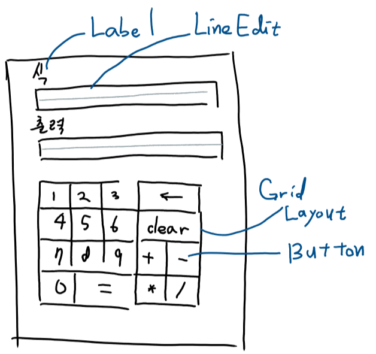

* PyQt 스터디 연습과제 1
---
계산기 만들어보기 (2018.09.14)
Deadline : 2018.09.20

** Detail
---
UI는 다음과 같다.

구현의 편의 상 몇 가지 제약 사항을 두고 있다.
1. 키보드로부터는 입력을 받지 않는다.
2. 수식 검증은 하지 않는다.
3. 표시 제한을 넘는 입력에 대하여 따로 처리하지 않는다.
4. 수식은 eval()로 계산한다.

